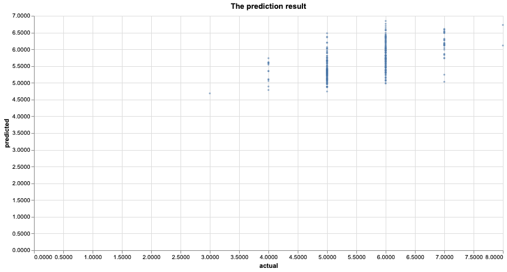

```{r setup, include=FALSE}
knitr::opts_chunk$set(echo = FALSE)
library(tidyverse)
library(knitr)
```

## Summary

To answer the question about predicting the red wine quality based on physiochemical properties, we propose a prediction model using linear regression algorithm. Based on the 1599 samples with 11 original physiochemical features, we deployed recursive feature elimination (RFE)  to select features by recursively considering smaller and smaller sets of features. It turned out that 6 physiochemical properties is significant contributing to a better model performance. Building such model is valuable to support oenologist wine tasting evaluations and improve wine production. 


## Introduction

According to [British Columbia Wine Institute]( https://winebc.com/industry/media/quick-facts/), the BC wine industry contributes approximately $2.8 billion annually to British Columbia’s economy. To facilitate the development of BC wine industry, stakeholders are seeking a better way to improve the wine production and selling process with new techniques applied. Globally, wine certification and quality assessment are essential given this context.

Wine quality assessment basically consists of two parts: the lab test and the sensory test. Physicochemical lab tests generally characterize wine based on features such as density, pH value, acidity, sugar, and alcohol, etc. While the sensory test is mainly relying on qualified experts. Due to the low interpretation of human sense, the relationship between sensory tests and the lab tests is somehow compared to a black box. The industry is curious about how ‘good’ the wine is, given the physicochemical lab test results.  Therefore, a model integrating physiochemical lab tests and sensory tests is helpful in addressing the industry concern, supporting the wine evaluation and thus improving local wine production.  


## Methodology

The data used in this project is obtain from the [University of California Irvine Machine learning Repository]( http://archive.ics.uci.edu/ml/datasets/Wine+Quality).  It contains 1599 samples from red wine produced in Portugal. Each sample represents 11 physiochemical properties (features) from lab tests and also the sensory result (response) ranging from 0 to 10.  


The Analysis portion of this project is done by Python. A standard scaler is used to scale all features into the same scale. To perform feature selection, we use scikit-learn's linear regression as an estimator and perform recursive feature selection. Reragding the number of features to select, we try the number from 1 to 11 (sum of features), we found after selecting six features, if we selected more, the model stop improving. Then we perform linear regression on the top six features by using scikit-learn's linear regression model.

The following Python packages were used in this project:

### R 

- docopt [@docopt]

- knitr [@knitr]

- tidyverse [@tidyverse]

- janitor[@janitor]

- reshape2[@reshape2]

- caret[@caret]

### Python

- docoptpython [@docoptpython]

- request[@request]

- pandas[@pandas]

- numpy[@numpy]

- altair[@altair]

- scikit-learn[@sklearn]


## Results

According to the optimization process, it turned out that 6 features are the best combination for our model based on the training and testing error. 

```{r feature ranking, echo=FALSE, fig.cap="Figure 2. The relationship between MSE and number of featurs", out.width = '100%'}
knitr::include_graphics("../results/ranked_features.png")
```

The six physiochemical properties and their weights are reported as blow:

```{r feature weight, echo=FALSE, fig.cap="Figure 1. Feature weight", out.width = '90%'}
knitr::include_graphics("../results/feature_weight_plot.png")
```

Based on the plot, we can see that: alchol is the most significant feature followed by volatile acidity and sulphates.

```{r prediction results, echo=FALSE, fig.cap="Figure 3. Prediction results", out.width = '90%'}

```


## References
